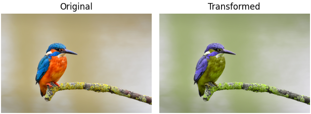

# CVD-simulation generator

Generate Machado matrices used to simulate color-vision deficiencies (CVDs) of various severities for given spectral power distributions of the optical channels of a color model (like RGB or CMY).

## Usage
In `utility.py`, the cone sensitivities of the human eye, the spectral power distribution for typical LCD and CRT screens, and the spectral power distribution for reflectance of typical printer ink under interior lighting are defined, along with helper functions to generate Machado matrices.

The script `plot_distributions.py` visualizes the cone sensitivities and spectral power distributions defined in `utility.py`.

The script `print_Machado_matrices.py` generates the Machado matrices for both the RGB and the CMY color model given their respective medium (LCD screen for RGB, ink-jet printer for CMY).
It generates Machado matrices for Protanopia and Deuteranopia for severities from 0 to 1 in increments of 0.1.
No matrices are generated for Tritanopia as the transformation is discouraged from being used for this type of CVD.

The scripts `rgb_cvd_simulation.py` and `cmy_cvd_simulation.py` visualize the effects of the CVD simulation in the RGB or the CMY color model, applied to the image `test_image.png`.
Beware that for the CMY simulation, alternative spectral power distributions are used to make the test useful on LCD screens.
